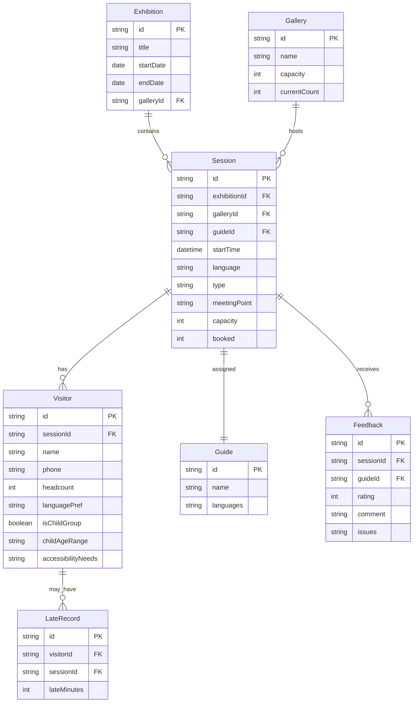

## 1. 架构设计

```mermaid
flowchart TB
    subgraph "前端层"
        "Vue3 + Vite"
        "Pinia 状态管理"
        "Vue Router"
        "TailwindCSS"
    end
    subgraph "数据层"
        "Mock 数据服务"
        "LocalStorage 持久化"
    end
    "Vue3 + Vite" --> "Pinia 状态管理"
    "Pinia 状态管理" --> "Mock 数据服务"
    "Pinia 状态管理" --> "LocalStorage 持久化"
```

纯前端架构，使用 Mock 数据模拟后端，数据通过 LocalStorage 持久化。

## 2. 技术说明

- **前端框架**：Vue3 + Composition API
- **构建工具**：Vite
- **样式方案**：TailwindCSS 3
- **状态管理**：Pinia
- **路由**：Vue Router 4
- **图表**：Chart.js + vue-chartjs
- **图标**：Lucide Vue Next
- **字体**：Noto Serif SC + Noto Sans SC（Google Fonts）
- **后端**：无（纯前端 Mock）
- **数据库**：无（LocalStorage + 内存 Mock）

## 3. 路由定义

| 路由 | 用途 |
|------|------|
| `/` | 导览总览页（默认首页） |
| `/sessions` | 场次管理页 |
| `/visitors` | 观众管理页 |
| `/statistics` | 统计总览页 |

## 4. 数据模型定义



## 5. 项目目录结构

```
src/
  assets/          # 静态资源
  components/      # 公共组件
    layout/        # 布局组件（侧栏、顶栏）
    common/        # 通用组件（状态标签、进度条）
  views/           # 页面组件
    Dashboard.vue  # 导览总览页
    Sessions.vue   # 场次管理页
    Visitors.vue   # 观众管理页
    Statistics.vue  # 统计总览页
  stores/          # Pinia 状态
    exhibition.ts
    session.ts
    visitor.ts
    gallery.ts
    guide.ts
    feedback.ts
  mock/            # Mock 数据
    data.ts
  router/          # 路由配置
    index.ts
  types/           # TypeScript 类型定义
    index.ts
  utils/           # 工具函数
  App.vue
  main.ts
```
